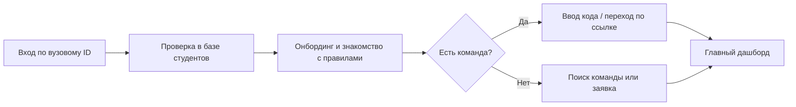
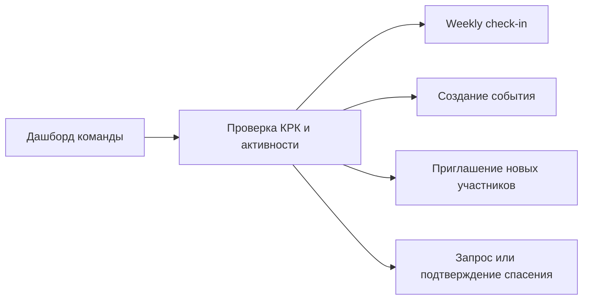
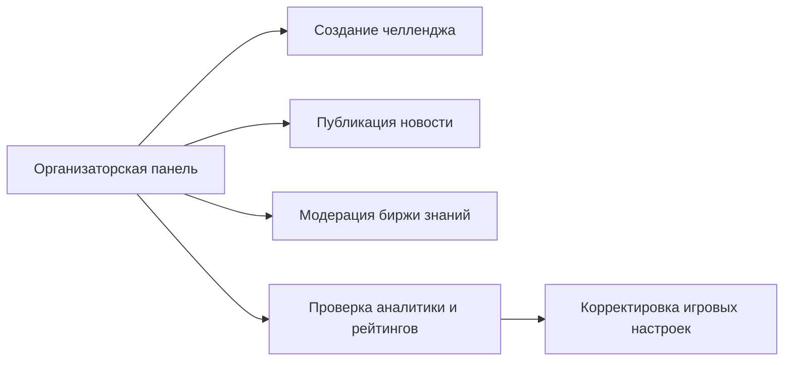

# UX/UI MVP для "Командного зачёта"

## 1. Контекст

"Командный зачёт" - это веб-платформа, которая превращает подготовку к сессии в командную игру. Продукт должен не просто отображать рейтинг, а поддерживать учебное взаимодействие, снижать стресс и усиливать ощущение общего прогресса.

С точки зрения UX/UI MVP должен дать пользователю быстрый ответ на три вопроса:

1. Что мне делать прямо сейчас?
2. Как моя активность влияет на команду?
3. Где я вижу прогресс, помощь и ближайшие возможности?

## 2. UX-цели MVP

- Сделать сложную рейтинговую систему прозрачной и визуально понятной.
- Поддержать мотивацию через прогресс, статусы, достижения и лиги.
- Упростить командные сценарии: вступление, координация, чек-ины, помощь.
- Снизить когнитивную нагрузку за счет ясной навигации и ролевого разделения.
- Дать организаторам управляемый интерфейс для модерации и аналитики.

## 3. Основные роли

### Студент

Видит личный прогресс, команду, ленту, челленджи, биржу знаний, календарь и достижения.

### Капитан

Получает все возможности студента плюс управление командой, приглашения, weekly check-in, координацию "спасения" и обзор вклада участников.

### Организатор

Работает с челленджами, новостями, модерацией, аналитикой, проверкой активности и настройкой рейтинговых сценариев.

## 4. Состав MVP

### Базовые экраны

- Вход и верификация студента.
- Онбординг с присоединением к команде или поиском команды.
- Главный дашборд студента.
- Профиль пользователя.
- Страница команды.
- Рейтинги и лиги.
- Лента активностей.
- Челленджи и экран отправки отчета.
- Биржа знаний.
- Календарь событий.
- Weekly check-in капитана.
- Механика "спасения".
- Анонимное голосование внутри команды.
- Организаторская панель.

### Что не является центром первого UX-цикла

- Сложные кастомные настройки профиля.
- Продвинутая social-сеть внутри продукта.
- Многоуровневые сценарии геймификации вне базовых ачивок и лиг.
- Полноценный мобильный нативный интерфейс: в MVP делаем адаптивный веб.

## 5. Информационная архитектура

### Навигация студента

- Главная
- Команда
- Рейтинги
- Активности
- Календарь
- Профиль

### Дополнительные действия капитана

- Пригласить в команду
- Заполнить check-in
- Открыть внутрикомандную оценку
- Создать событие
- Оформить "спасение"

### Навигация организатора

- Обзор
- Челленджи
- Новости
- Модерация
- Аналитика
- Рейтинги
- Пользователи и команды

## 6. Ключевые пользовательские сценарии

### 6.1. Новый студент

### 6.2. Капитан команды

### 6.3. Организатор

## 7. UX-решения по требованиям ТЗ

### Прозрачность КРК

КРК нельзя показывать одной цифрой без объяснения. В интерфейсе MVP он разложен на три составляющих:

- базовый рейтинг;
- сплоченность;
- бонусы.

Это нужно, чтобы команда понимала, как на результат влияет успеваемость, участие и помощь другим.

### Низкий стресс

Поскольку продукт связан с сессией, интерфейс не должен ощущаться как "еще одна учебная система". Поэтому используются:

- крупные карточки;
- короткие CTA;
- визуальный прогресс;
- понятные статусы;
- акцент на поддержке, а не на наказании.

### Сильная командная идентичность

В MVP команда - это центральная сущность. Пользователь постоянно видит:

- название и визуальный образ команды;
- текущее место в лиге;
- командный КРК;
- вклад участников;
- ближайшие действия, которые помогут команде.

### Доверие к системе

Для спорных и чувствительных механик используются отдельные статусы и подтверждения:

- "спасение" имеет фиксируемые этапы;
- биржа знаний ведется через статус заявки;
- анонимная оценка вклада сопровождается объяснением, зачем она нужна;
- важные действия организаторов имеют явный контрольный след в интерфейсе.

## 8. Визуальная система

### Настроение

Интерфейс строится на сочетании темного графитового фона и теплого оранжевого акцента. Это направление взято из референсов: оно хорошо подчеркивает прогресс, энергию и игровые механики.

### Дизайн-принципы

- Крупные радиусы и карточная композиция.
- Высокий контраст для ключевых метрик.
- Оранжевый цвет только для действий, прогресса и значимых чисел.
- Плотная, но не перегруженная информационная иерархия.
- Одинаковый язык компонентов для веба и будущей мобильной версии.

### Базовые UI-сущности

- геро-блок с главным состоянием пользователя;
- карточки командного прогресса;
- лидерборд с табами;
- список достижений;
- карточки событий и новостей;
- статусы заявок на бирже знаний;
- таблицы и канбан-подобные блоки для админки.

## 9. Почему такая структура подходит для MVP

- Она покрывает все обязательные модули из ТЗ.
- Ее можно быстро перевести в Figma и затем в разработку.
- Она сразу показывает различия ролей, не размазывая логику по одному экрану.
- Она масштабируется: можно добавлять новые потоки, лиги, сценарии и контент без перестройки всей навигации.

## 10. Что уже отражено в прототипе

В `prototype/index.html` визуально показаны:

- главный экран студента;
- челлендж и блок прогресса;
- лидерборд;
- достижения;
- календарь и лента;
- рабочая зона капитана;
- биржа знаний и статусы;
- weekly check-in;
- сценарий анонимного голосования;
- организаторская консоль;
- аналитика и модерация.
